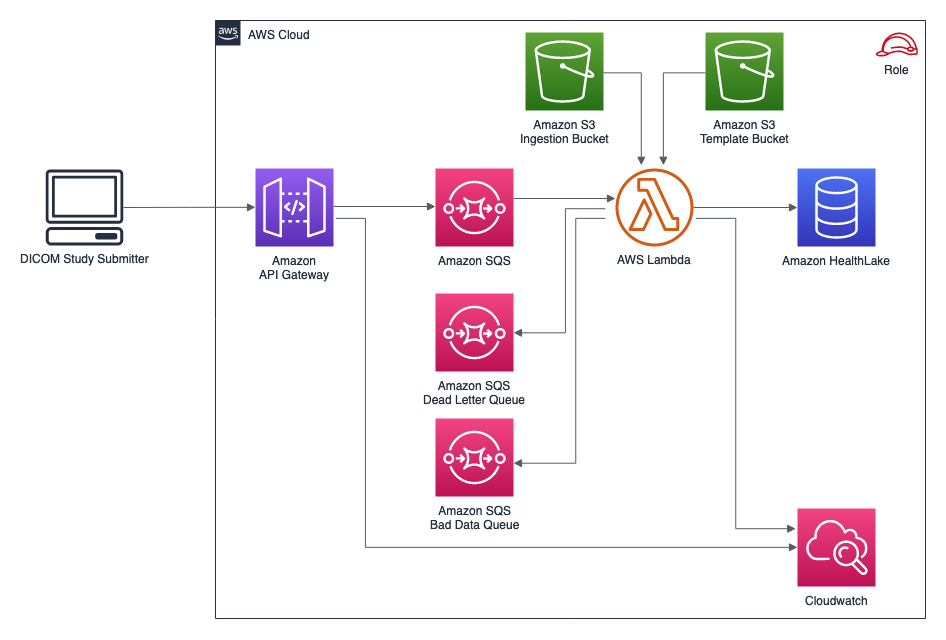

# Simple DICOM Extension for Amazon HealthLake
### Key project features:
* An extension for Amazon HealthLake (AHL) that simplifies managing medical imaging data (in DICOM format).  With this service, AHL becomes a unified, searchable datastore for analtyics across disparate data modalities.
* For each medical imaging Study, a [FHIR ImagingStudy](http://hl7.org/fhir/R4/imagingstudy.html) resource is created and stored to an AHL Data Store.  The ImagingStudy resource contains selected meta-data for the study, series, and details of each SOP instance.
* DICOM objects remain unchanged on Amazon S3.
* Downstream analytics can consume the metadata in the FHIR resource and/or link back to the DICOM SOP instances on S3 (for tasks that require the pixel data, like computer vision).
* This project is able to process large DICOM files, and operate at high study volumes.
* The design is simple, extensible, and adaptable to the requirements of your project.
* This project is implemented with the [Amazon CDK](https://aws.amazon.com/cdk/) for Python.

No warranty is implied in this project.

## Architecture Overview



### Logical Components

* Amazon API Gateway: Provides a RESTful interface to the service.  
* Amazon SQS Queue: A standard queue brokers submitted payloads, and ensures consistent performance under bursty workloads.
* Amazon S3: Durable, performant object storage for DICOM objects and configuration files.
* AWS Lambda: Consumes messages from the queue, reads metadata from each DICOM SOP Instance object, generates a FHIR ImagingStudy resource, and POSTs a FHIR resource to AHL.
* Amazon HealthLake: a HIPAA-eligible service offering a complete view of health data for query and analytics at scale. 

## Implementation Details

This project is intented to be used with a system that aggregates DICOM SOP Instances into Study groups, as is often done by a PACS, VNA, or similar system.  The payload submitted to the API Gateway should contain a set of SOP Instances corresponding to one medical imaging Study (e.g. one examination ordered by a physician, which may include multiple series and SOP instances).  
The payload is expected to contain an S3 bucket, and list of SOP instance keys within that bucket.  For example: 
```json
{"bucket":"dicom-ahl-bucket",
 "instances":["one.dcm",
              "two.dcm",
              "three.dcm"]}
```

#### API Gateway
A RESTful API with POST method.  Payloads received are encrypted.
In production environments, connections to the API should be [protected](https://docs.aws.amazon.com/apigateway/latest/developerguide/rest-api-protect.html)

#### SQS Queues
A standard SQS queue, with encryption enabled, brokers payloads received from the API Gateway.  A dead letter queue captures payloads that cannot be processed. Individual DICOM SOP instances with problematic meta-data are sent to a bad data queue.  This project does not include logic for processing payloads that route to the dead letter queue or bad data queue.

#### AWS Lambda
A Lambda function consumes messages from SQS.  Each message payload contains a set of DICOM SOP instances, stored on S3, that correspond to a single imaging study .  Messages are 1-to-1 with studies. The function reads each SOP instance, confirms Study Instance UID, and writes SOP Instances with non-matching Study Instance UID to the bad data queue.  The function outputs a single [FHIR Imaging Study](http://hl7.org/fhir/R4/imagingstudy.html) resource, with all cooresponding SOP instances captured in respective series within the resource. Further, the [instance](http://hl7.org/fhir/R4/imagingstudy-definitions.html#ImagingStudy.series.instance) element is extended with an endpoint attribute that points to the S3 storage location of the original SOP Instance.

The structure of the output ImagingStudy resource is configured with the resource [template](./templates/imagingstudy-example.json). The [template map](./templates/imagingstudy-example-map.json) specifies what meta-data will be taken from the SOP Instances and written to the FHIR resource.  These configuration resources can be updated without redeploying the Lambda function.

"template_map" contains a map between DICOM tags and the location of corresponding element in the FHIR template.  

Additional transformations can be applied to update the FHIR resource after it is assembled.  The [Study class](./lambdas/aggregator.py) performs the mapping of DICOM meta-data to a FHIR ImagingStudy resource.  You can add additional transformation logic to update the FHIR output in the _transform_fhir function of the Study class.

The output ImagingStudy resource contains a series attribute with an element attribute that can be configured to point to your [WADO-RS](https://www.dicomstandard.org/dicomweb/retrieve-wado-rs-and-wado-uri) server if available.  This change can be made at `lambdas/aggregator.py` in the `_series_to_FHIR` function of the Study class.

## Deployment Instructions

1. [Create an AWS account](https://portal.aws.amazon.com/gp/aws/developer/registration/index.html) if you do not already have one and login.
1. [Install Git](https://git-scm.com/book/en/v2/Getting-Started-Installing-Git) and [install the AWS Serverless Application Model CLI](https://docs.aws.amazon.com/serverless-application-model/latest/developerguide/serverless-sam-cli-install.html) on your local machine.
1. Install and launch Docker on your local machine.
1. [Install the AWS CDK](https://docs.aws.amazon.com/cdk/latest/guide/getting_started.html).  This project requires AWS CDK >= 2.7. Run `cdk --version ` to check the CLI version.
1. Create a new directory and navigate to that directory in a terminal.
1. Clone this repo to that directory:

    ```
    git clone https://github.com/aws-samples/dicom_ahl
    ```
1. Create a virtual environment with `python3` and install the requirements:
    ```
    $ pip install -r requirements.txt
    ```
1. Create an Amazon Healthlake Data Store by following the steps in the [HealthLake documentation](https://https://docs.aws.amazon.com/healthlake/latest/devguide/getting-started-amazon-health-lake.html), if you have not already. 
1. Update the file `dicom_ahl/config.json` with the details of the [Amazon HealthLake Data Store](https://docs.aws.amazon.com/healthlake/latest/devguide/working-with-FHIR-healthlake.html).
1. At this point you can synthesize the CloudFormation template for this code, with this command:
    ```
    $ cdk synth
    ```
1. Deploy the project with this command:
    ```
    $ cdk deploy
    ```
    This project is implemented as a CDK app, which deploys an instance of a stack (`dicom_ahl`).
1. Copy the template and template map files to the template S3 bucket created during the deployment.  The name of the template S3 bucket will be output by the deployed cloud formation stack.
1. Test the deployment by copying DICOM objects to the S3 ingestion bucket, and submitting a payload to the API Gateway.  The names of the ingestion S3 bucket and API gateway will both be output by the deployed cloud formation stack.

## Application Configuration Options
`dicom_ahl/config.json`
* "region": Region to deploy to, and where pre-existing HealthLake Data Store is.
* "dicom"/"sop_instance_bytes_to_read": Bytes of object data to read from each SOP Instance object for meta-data processing.  This setting defends against ingesting an object that exceeds the Lambda function's memory.
* "fhir"/"template_key": S3 key (object name) for FHIR template.
* "fhir"/"template_map_key": S3 key (object name) for FHIR template.  

`templates/imagingstudy-example.json`
* The base template for the FHIR Imaging study resource that will be created and POSTed to AHL.  

`templates/imagingstudy-example-map.json`
* Specifies the DICOM tags to map to elements in the FHIR resource.  Any elements of the FHIR template not in tags_to_fhir will retain their default template value.


### How to call the API when deployed
* Place SOP instances ("one.dcm", "two.dcm", "three.dcm") corresponding to an imaging study on S3 in the injestion bucket ("dicom-ahl-example")
* Post payload to the API endpoint: 

      `curl -X POST https://ysqtmsa1y9.execute-api.us-east-1.amazonaws.com/prod/study 
        -H 'Content-Type: application/json' 
        -d '{"bucket":"dicom-ahl-example","instances":["one.dcm","two.dcm","three.dcm"]}'`

   Here the bucket, `dicom-ahl-example`, could be the bucket created by this project, or any other bucket
   that grants the lambda function permission to read the referenced objects.
* See newly created resource in the HealthLake Data Store.
* Events will be logged to CloudWatch.

## Tests
This project includes a basic suite of fine-grained unit tests that test aspects of the generated AWS CloudFormation template.
The tests are implemented with the pytest framework and CDK testing classes.  The test suite can be run with the command:  

```
python -m pytest
```  

Or a specific test module can be run with a command like:  

```
python -m pytest ./tests/test_study_stack.py
```

## Roadmap:
* Parallelize Lambda function for faster processing
* Formalize how to integrate WADORS system to flow through series endpoint resource
* Structured logging

## Additional Resources

Examples of JSON format ImagingStudy FHIR resources:
* Basic: http://hl7.org/fhir/R4/imagingstudy.html 

* Richer: https://www.hl7.org/fhir/imagingstudy-example-xr.json.html